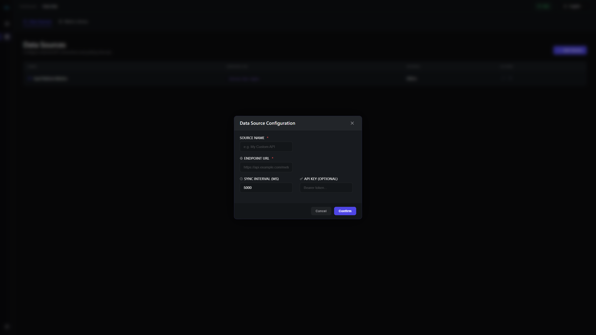
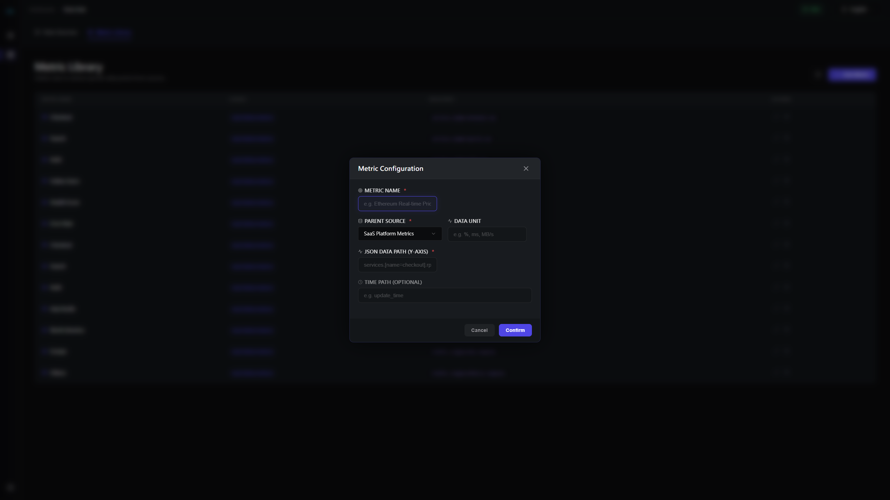
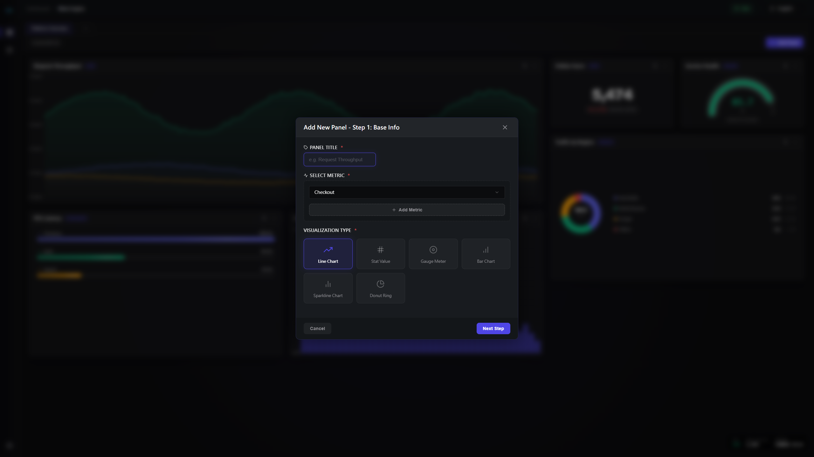
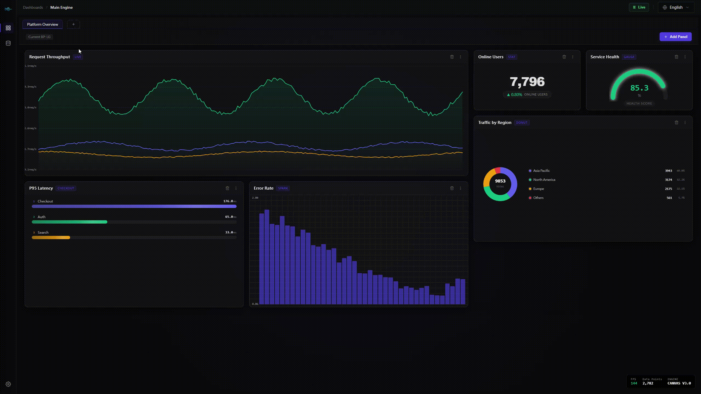

# OmniStream 🚀

**[English](README.md)** | **[繁體中文]**

---

## 🔗 快速連結
- **<a href="https://smr24425.github.io/omnistream-api-dashboard/" target="_blank">線上測試 Demo</a>**

---

## 🌟 「開箱即用」的通用 API 數據儀表板

**OmniStream** 是一款為開發者量身打造的現代化即時監控看板。與傳統平台不同，它的核心理念是 **「真正的通用性」** —— 無需繁瑣的後端設定，只需填入任何 JSON API 網址，即可在幾秒鐘內實現數據視覺化。

**我的目標：** 讓任何「知道 API 網址」的人，都能在不需要撰寫任何程式碼的情況下，快速建立起專業級的監控面板。

無論是監控 SaaS 關鍵指標、IoT 感測器數據，還是加密貨幣價格，OmniStream 都能流暢處理數據流，並內建了針對 **CORS 跨域限制**的 Cloudflare Workers 代理教學。

---

## ✨ 產品亮點

- 📦 **零配置看板**：使用 `react-grid-layout` 自由拖拽、縮放與排列面板，定義專屬佈局。
- 🌐 **通用數據獲取**：只要有 JSON API 網址，即可透過自定義 JSON Path 輕鬆提取所需數據。
- 🛡️ **CORS 支援**：整合 Cloudflare 代理引導，徹底消除前端開發最頭痛的跨域錯誤。
- 🌍 **國際化支援**：完整支援英文與繁體中文語系切換 (i18n)。
- 🛠️ **開發者友善**：基於 **React 19** 與 **TypeScript** 構建；代碼整潔、模組化且極易自定義。

---

## 📸 視覺導覽

### 1. 快速對接 API 數據源
只需輸入 API 終端 URL 與同步頻率，即可輕鬆串接任何數據源。內建 Cloudflare Worker 代理引導，徹底解決跨域問題。


### 2. 精確提取指標數據 (JSON Path)
支援強大的 JSON Path 語法，無論 API 結構多複雜，都能精確提取出目標數值或數組。


### 3. 多樣化的視覺化面板
提供折線圖、單一統計值、儀表盤、環狀圖等多元面板，並支援自定義單位與進階設定。


### 4. 高靈活性的儀表板佈局
基於 `react-grid-layout`，所有面板皆可自由拖拽移動、縮放大小，佈局會自動保存至本地。


---

## 🚀 快速開始

### 環境需求
- **Node.js**: 18+ (推薦)
- **套件管理工具**: npm / pnpm / yarn

### 本地運行
```bash
# 複製儲存庫
git clone https://github.com/smr24425/omnistream-api-dashboard.git

# 安裝依賴
npm install

# 啟動開發伺服器
npm run dev
```
> 在瀏覽器中開啟 `http://localhost:5173` 即可開始配置你的數據面板。

---

## 🛠️ 技術棧

- **框架**: React 19 (最新版)
- **語言**: TypeScript
- **構建工具**: Vite
- **UI 組件**: Sass / CSS Modules
- **第三方庫**: react-grid-layout, react-router-dom, i18next

---

## 🗺️ 應用場景

- **API 狀態監控**：即時追蹤第三方服務的可用性與健康狀況。
- **商業智能 (BI)**：視覺化 SaaS 指標，如 DAU、轉換率或營收數據。
- **IoT 視覺化**：串接智慧家居感測器，追蹤溫度、濕度或用電量。
- **加密貨幣追蹤**：透過交易所 API 獲取即時價格走勢。

---

## 🤝 貢獻與反饋

歡迎任何形式的貢獻、回報問題 (Issues) 或功能建議！請隨時查看 [Issues 頁面](https://github.com/smr24425/omnistream-api-dashboard/issues)。